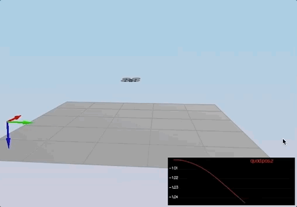

# Flying Cars - Project 3 - Implementing Controllers (Body Rate, Roll/Pitch, Position, Velocity, Yaw)   #

For easy navigation throughout this document, here is an outline:
 - [Simulator, Code and Config](#simulator-code-and-config)
 - [The tasks](#the-tasks)
 - [Results](#results)
 - [Development environment setup](#development-environment-setup)

## Simulator, Code and Config ##

#### The Simulator ####

In the simulator window itself, you can right click the window to select between a set of different scenarios that are designed to test the different parts of your controller.

When the simulation is running, you can use the arrow keys on your keyboard to impact forces on your drone to see how your controller reacts to outside forces being applied.

There are a handful of keyboard / mouse commands to help with the simulator itself, including applying external forces on your drone to see how your controllers reacts!
 - Left drag - rotate
 - X + left drag - pan
 - Z + left drag - zoom
 - arrow keys - apply external force
 - C - clear all graphs
 - R - reset simulation
 - Space - pause simulation

The simulation (including visualization) is implemented in a single thread.  This is so that you can safely breakpoint code at any point and debug, without affecting any part of the simulation. Due to deterministic timing and careful control over how the pseudo-random number generators are initialized and used, the simulation should be exactly repeatable. This means that any simulation with the same configuration should be exactly identical when run repeatedly or on different machines. Vehicles are created and graphs are reset whenever a scenario is loaded. When a scenario is reset (due to an end condition such as time or user pressing the ‘R’ key), the config files are all re-read and state of the simulation/vehicles/graphs is reset -- however the number/name of vehicles and displayed graphs are left untouched.
Once you have the simulator running, you can observe the effects of the code changes in the simulator itself. In order to get the simulator up and running, your development environment will need to be set up. For instructions on how to set up your development environment, see the development environment setup portion of this README document. 

#### The Code ####

For this project, all the code was written in `src/QuadControl.cpp`. 

#### The Config ####

All the configuration files for the controller and the vehicle are in the `config` directory.  Changes were made to the `QuadControlParams.txt` text file. Any changes to this file can be observed in real time and the effect is shown in the quad(s) in the simulator. 

## The Tasks ##

### Introduction - Hover (scenario 1) ###

When you run the simulator, you'll notice your quad is falling straight down.  This is due to the fact that the thrusts are simply being set to:
```
QuadControlParams.Mass * 9.81 / 4
```
If the mass doesn't match the actual mass of the quad, it'll fall down.  The `Mass` parameter in `QuadControlParams.txt` was tuned to make the vehicle more or less stay in the same spot.

With the proper mass set, the quad hovered more or less in the same spot as shown below.

<p align="center">

</p>

### Body rate and roll/pitch control (scenario 2) ###

In order to make the Quad fly the required trajectory, its body rate, roll and pitch has to be controlled. The rotational axis needs to be controlled so that the quad is stable and leveled in its attitude. 

1. The body rate control was implemened as follows:

 - The `GenerateMotorCommands()` method was modified (lines XX) to compute the thrust force for each motor and the collective thrust. l is computed as the distance from the vehicle (quad) origin to the motor over the square root of two or 1.414213562373095. kappa value is the drag/thrust ratio. 
Note that the force in z axis is inverted since D (down) in NED coordinates in pointing down. 
Thrusts for each motor (t1 to t4) is the computed as shown below 

    float t1 = momentCmd.x / l; // (L*(1.414213562373095/2));
    float t2 = momentCmd.y / l;  // (L*(1.414213562373095/2));
    float t3 =  - momentCmd.z/kappa;
    float t4 = collThrustCmd;

Desired thrust is computed as follows
    cmd.desiredThrustsN[0] = (t1 + t2 + t3 + t4)/4.0f; // front left (f1)
    cmd.desiredThrustsN[1] = (-t1 + t2 - t3 + t4)/4.0f; // front right (f2)
    cmd.desiredThrustsN[2] = (t1 - t2 - t3 + t4)/4.0f; // rear left (f4)
    cmd.desiredThrustsN[3] = (-t1 - t2 + t3 + t4)/4.0f; // rear right (f3)

Desired thrust is then constrained to be within the minumum and maximum allowed motor thrurst values set in the config file
    cmd.desiredThrustsN[0] = CONSTRAIN(cmd.desiredThrustsN[0],minMotorThrust, maxMotorThrust);
    cmd.desiredThrustsN[1] = CONSTRAIN(cmd.desiredThrustsN[1],minMotorThrust, maxMotorThrust);
    cmd.desiredThrustsN[2] = CONSTRAIN(cmd.desiredThrustsN[2],minMotorThrust, maxMotorThrust);
    cmd.desiredThrustsN[3] = CONSTRAIN(cmd.desiredThrustsN[3],minMotorThrust, maxMotorThrust);
 


Where all the F_1 to F_4 are the motor's thrust, tao(x,y,z) are the moments on each direction, F_t is the total thrust, kappa is the drag/thrust ratio and l is the drone arm length over square root of two. These equations come from the classroom lectures. There are a couple of things to consider. For example, on NED coordinates the z axis is inverted that is why the moment on z was inverted here. Another observation while implementing this is that F_3 and F_4 are switched, e.g. F_3 in the lectures is F_4 on the simulator and the same for F_4.

The second step is to implement the BodyRateControl method applying a P controller and the moments of inertia. At this point, the kpPQR parameter has to be tuned to stop the drone from flipping, but first, some thrust needs to be commanded in the altitude control because we don't have thrust commanded on the GenerateMotorCommands anymore. A good value is thurst = mass * CONST_GRAVITY.

Once this is done, we move on to the RollPitchControl method. For this implementation, you need to apply a few equations. You need to apply a P controller to the elements R13 and R23 of the rotation matrix from body-frame accelerations and world frame accelerations:

Roll and pitch P controller

But the problem is you need to output roll and pitch rates; so, there is another equation to apply:

From b to pq

It is important to notice you received thrust and thrust it need to be inverted and converted to acceleration before applying the equations. After the implementation is done, start tuning kpBank and kpPQR(again? yes, and it is not the last time) until the drone flies more or less stable upward:

C++ Scenario 2

This video is cpp-scenario-2.mov

When the scenario is passing the test, you should see this line on the standard output:

PASS: ABS(Quad.Roll) was less than 0.025000 for at least 0.750000 seconds
PASS: ABS(Quad.Omega.X) was less than 2.500000 for at least 0.750000 seconds
 
 
 - implement the code in the function `BodyRateControl()`
 - Tune `kpPQR` in `QuadControlParams.txt` to get the vehicle to stop spinning quickly but not overshoot

If successful, you should see the rotation of the vehicle about roll (omega.x) get controlled to 0 while other rates remain zero.  Note that the vehicle will keep flying off quite quickly, since the angle is not yet being controlled back to 0.  Also note that some overshoot will happen due to motor dynamics!.

If you come back to this step after the next step, you can try tuning just the body rate omega (without the outside angle controller) by setting `QuadControlParams.kpBank = 0`.

2. Implement roll / pitch control
We won't be worrying about yaw just yet.

 - implement the code in the function `RollPitchControl()`
 - Tune `kpBank` in `QuadControlParams.txt` to minimize settling time but avoid too much overshoot

If successful you should now see the quad level itself (as shown below), though it’ll still be flying away slowly since we’re not controlling velocity/position!  You should also see the vehicle angle (Roll) get controlled to 0.

<p align="center">

</p>


### Position/velocity and yaw angle control (scenario 3) ###

Next, you will implement the position, altitude and yaw control for your quad.  For the simulation, you will use `Scenario 3`.  This will create 2 identical quads, one offset from its target point (but initialized with yaw = 0) and second offset from target point but yaw = 45 degrees.

 - implement the code in the function `LateralPositionControl()`
 - implement the code in the function `AltitudeControl()`
 - tune parameters `kpPosZ` and `kpPosZ`
 - tune parameters `kpVelXY` and `kpVelZ`

If successful, the quads should be going to their destination points and tracking error should be going down (as shown below). However, one quad remains rotated in yaw.

 - implement the code in the function `YawControl()`
 - tune parameters `kpYaw` and the 3rd (z) component of `kpPQR`

Tune position control for settling time. Don’t try to tune yaw control too tightly, as yaw control requires a lot of control authority from a quadcopter and can really affect other degrees of freedom.  This is why you often see quadcopters with tilted motors, better yaw authority!

<p align="center">

</p>

**Hint:**  For a second order system, such as the one for this quadcopter, the velocity gain (`kpVelXY` and `kpVelZ`) should be at least ~3-4 times greater than the respective position gain (`kpPosXY` and `kpPosZ`).

### Non-idealities and robustness (scenario 4) ###

In this part, we will explore some of the non-idealities and robustness of a controller.  For this simulation, we will use `Scenario 4`.  This is a configuration with 3 quads that are all are trying to move one meter forward.  However, this time, these quads are all a bit different:
 - The green quad has its center of mass shifted back
 - The orange vehicle is an ideal quad
 - The red vehicle is heavier than usual

1. Run your controller & parameter set from Step 3.  Do all the quads seem to be moving OK?  If not, try to tweak the controller parameters to work for all 3 (tip: relax the controller).

2. Edit `AltitudeControl()` to add basic integral control to help with the different-mass vehicle.

3. Tune the integral control, and other control parameters until all the quads successfully move properly.  Your drones' motion should look like this:

<p align="center">

</p>


### Tracking trajectories ###

Now that we have all the working parts of a controller, you will put it all together and test it's performance once again on a trajectory.  For this simulation, you will use `Scenario 5`.  This scenario has two quadcopters:
 - the orange one is following `traj/FigureEight.txt`
 - the other one is following `traj/FigureEightFF.txt` - for now this is the same trajectory.  For those interested in seeing how you might be able to improve the performance of your drone by adjusting how the trajectory is defined, check out **Extra Challenge 1** below!

How well is your drone able to follow the trajectory?  It is able to hold to the path fairly well?


### Extra Challenge 1 (Optional) ###

You will notice that initially these two trajectories are the same. Let's work on improving some performance of the trajectory itself.

1. Inspect the python script `traj/MakePeriodicTrajectory.py`.  Can you figure out a way to generate a trajectory that has velocity (not just position) information?

2. Generate a new `FigureEightFF.txt` that has velocity terms
Did the velocity-specified trajectory make a difference? Why?

With the two different trajectories, your drones' motions should look like this:

<p align="center">

</p>


### Extra Challenge 2 (Optional) ###

For flying a trajectory, is there a way to provide even more information for even better tracking?

How about trying to fly this trajectory as quickly as possible (but within following threshold)!


## Results ##

To assist with tuning of your controller, the simulator contains real time performance evaluation.  We have defined a set of performance metrics for each of the scenarios that your controllers must meet for a successful submission.

There are two ways to view the output of the evaluation:

 - in the command line, at the end of each simulation loop, a **PASS** or a **FAIL** for each metric being evaluated in that simulation
 - on the plots, once your quad meets the metrics, you will see a green box appear on the plot notifying you of a **PASS**


### Performance Metrics ###

The specific performance metrics are as follows:

 - scenario 2
   - roll should less than 0.025 radian of nominal for 0.75 seconds (3/4 of the duration of the loop)
   - roll rate should less than 2.5 radian/sec for 0.75 seconds

 - scenario 3
   - X position of both drones should be within 0.1 meters of the target for at least 1.25 seconds
   - Quad2 yaw should be within 0.1 of the target for at least 1 second


 - scenario 4
   - position error for all 3 quads should be less than 0.1 meters for at least 1.5 seconds

 - scenario 5
   - position error of the quad should be less than 0.25 meters for at least 3 seconds

## Authors ##

Thanks to Fotokite for the initial development of the project code and simulator.


## Development Environment Setup ##

Regardless of your development platform, the first step is to download or clone this repository.

Once you have the code for the simulator, you will need to install the necessary compiler and IDE necessary for running the simulator.

Here are the setup and install instructions for each of the recommended IDEs for each different OS options:

### Windows ###

For Windows, the recommended IDE is Visual Studio.  Here are the steps required for getting the project up and running using Visual Studio.

1. Download and install [Visual Studio](https://www.visualstudio.com/vs/community/)
2. Select *Open Project / Solution* and open `<simulator>/project/Simulator.sln`
3. From the *Project* menu, select the *Retarget solution* option and select the Windows SDK that is installed on your computer (this should have been installed when installing Visual Studio or upon opening of the project).
4. Make sure platform matches the flavor of Windows you are using (x86 or x64). The platform is visible next to the green play button in the Visual Studio toolbar:


5. To compile and run the project / simulator, simply click on the green play button at the top of the screen.  When you run the simulator, you should see a single quadcopter, falling down.


### OS X ###

For Mac OS X, the recommended IDE is XCode, which you can get via the App Store.

1. Download and install XCode from the App Store if you don't already have it installed.
2. Open the project from the `<simulator>/project` directory.
3. After opening project, you need to set the working directory:
  1. Go to *(Project Name)* | *Edit Scheme*
  2. In new window, under *Run/Debug* on left side, under the *Options* tab, set Working Directory to `$PROJECT_DIR` and check ‘use custom working directory’.
  3. Compile and run the project. You should see a single quadcopter, falling down.


### Linux ###

For Linux, the recommended IDE is QtCreator.

1. Download and install QtCreator.
2. Open the `.pro` file from the `<simulator>/project` directory.
3. Compile and run the project (using the tab `Build` select the `qmake` option.  You should see a single quadcopter, falling down.

**NOTE:** You may need to install the GLUT libs using `sudo apt-get install freeglut3-dev`


### Advanced Versions ###

These are some more advanced setup instructions for those of you who prefer to use a different IDE or build the code manually.  Note that these instructions do assume a certain level of familiarity with the approach and are not as detailed as the instructions above.

#### CLion IDE ####

For those of you who are using the CLion IDE for developement on your platform, we have included the necessary `CMakeLists.txt` file needed to build the simulation.

#### CMake on Linux ####

For those of you interested in doing manual builds using `cmake`, we have provided a `CMakeLists.txt` file with the necessary configuration.

**NOTE: This has only been tested on Ubuntu 16.04, however, these instructions should work for most linux versions.  Also note that these instructions assume knowledge of `cmake` and the required `cmake` dependencies are installed.**

1. Create a new directory for the build files:

```sh
cd FCND-Controls-CPP
mkdir build
```

2. Navigate to the build directory and run `cmake` and then compile and build the code:

```sh
cd build
cmake ..
make
```

3. You should now be able to run the simulator with `./CPPSim` and you should see a single quadcopter, falling down.
