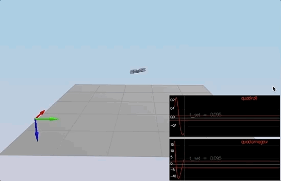
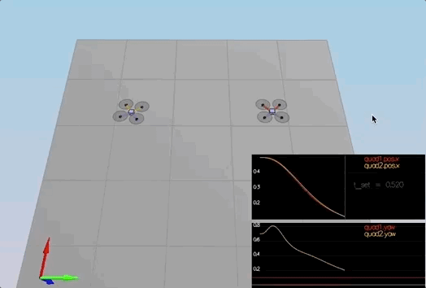
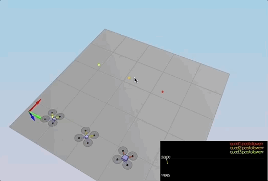
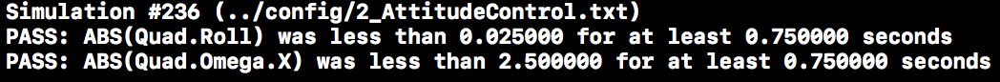
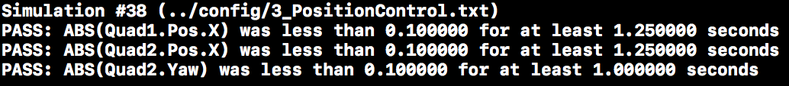
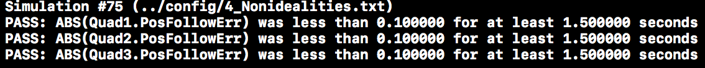

# Flying Cars - Project 3 - Implementing Controllers (Body Rate, Roll/Pitch, Position, Velocity, Yaw)   #

For easy navigation throughout this document, here is an outline:
 - [Simulator, Code and Config](#simulator-code-and-config)
 - [The tasks](#the-tasks)
 - [Results](#results)
 - [Development environment setup](#development-environment-setup)

## Simulator, Code and Config ##

#### The Simulator ####

In the simulator window itself, you can right click the window to select between a set of different scenarios that are designed to test the different parts of your controller.

When the simulation is running, you can use the arrow keys on your keyboard to impact forces on your drone to see how your controller reacts to outside forces being applied.

There are a handful of keyboard / mouse commands to help with the simulator itself, including applying external forces on your drone to see how your controllers reacts!
 - Left drag - rotate
 - X + left drag - pan
 - Z + left drag - zoom
 - arrow keys - apply external force
 - C - clear all graphs
 - R - reset simulation
 - Space - pause simulation

The simulation (including visualization) is implemented in a single thread.  This is so that you can safely breakpoint code at any point and debug, without affecting any part of the simulation. Due to deterministic timing and careful control over how the pseudo-random number generators are initialized and used, the simulation should be exactly repeatable. This means that any simulation with the same configuration should be exactly identical when run repeatedly or on different machines. Vehicles are created and graphs are reset whenever a scenario is loaded. When a scenario is reset (due to an end condition such as time or user pressing the ‘R’ key), the config files are all re-read and state of the simulation/vehicles/graphs is reset -- however the number/name of vehicles and displayed graphs are left untouched.
Once you have the simulator running, you can observe the effects of the code changes in the simulator itself. In order to get the simulator up and running, your development environment will need to be set up. For instructions on how to set up your development environment, see the development environment setup portion of this README document. 

#### The Code ####

For this project, all the code was written in `src/QuadControl.cpp`. 

#### The Config ####

All the configuration files for the controller and the vehicle are in the `config` directory.  Changes were made to the `QuadControlParams.txt` text file. Any changes to this file can be observed in real time and the effect is shown in the quad(s) in the simulator. 

## The Tasks ##

### Introduction - Hover (scenario 1) ###

When you run the simulator, you'll notice your quad is falling straight down.  This is due to the fact that the thrusts are simply being set to:
```
QuadControlParams.Mass * 9.81 / 4
```
If the mass doesn't match the actual mass of the quad, it'll fall down.  The `Mass` parameter in `QuadControlParams.txt` was tuned to make the vehicle more or less stay in the same spot.

With the proper mass set, the quad hovered more or less in the same spot as shown below.

<p align="center">

</p>

### Body rate and roll/pitch control (scenario 2) ###

In order to make the Quad fly the required trajectory, its body rate, roll and pitch has to be controlled. The rotational axis needs to be controlled so that the quad is stable and leveled in its attitude. 

The body rate control was implemened by making changes to the `GenerateMotorCommands()` , `BodyRateControl()`, in the QuadControl.cpp file in the src directory and tuning values in the QuadControlParams.txt file in the config directory.

The `GenerateMotorCommands()` method was modified (lines XX) to compute the thrust force for each motor and the collective thrust. l is computed as the distance from the vehicle (quad) origin to the motor over the square root of two or 1.414213562373095. kappa value is the drag/thrust ratio. 
Note that the force in z axis is inverted since D (down) in NED coordinates in pointing down. 
Thrusts for each motor (t1 to t4) is the computed as shown below 
```
    float t1 = momentCmd.x / l; // (L*(1.414213562373095/2));
    float t2 = momentCmd.y / l;  // (L*(1.414213562373095/2));
    float t3 =  - momentCmd.z/kappa;
    float t4 = collThrustCmd;
```
Desired thrust is computed used the equations below. Note, the rear left and rear right motors are swapped in order.
```
    cmd.desiredThrustsN[0] = (t1 + t2 + t3 + t4)/4.0f; // front left (f1)
    cmd.desiredThrustsN[1] = (-t1 + t2 - t3 + t4)/4.0f; // front right (f2)
    cmd.desiredThrustsN[2] = (t1 - t2 - t3 + t4)/4.0f; // rear left (f4)
    cmd.desiredThrustsN[3] = (-t1 - t2 + t3 + t4)/4.0f; // rear right (f3)
```
Desired thrust is then constrained to be within the minumum and maximum allowed motor thrurst values set in QuadControlParams text file [https://github.com/manopaul/Flying-Cars-P3-Controller/blob/master/config/QuadControlParams.txt] in the config directory. Minimum thrust is set to .1 and Maximum thrust is set to 4.5
```
    cmd.desiredThrustsN[0] = CONSTRAIN(cmd.desiredThrustsN[0],minMotorThrust, maxMotorThrust);
    cmd.desiredThrustsN[1] = CONSTRAIN(cmd.desiredThrustsN[1],minMotorThrust, maxMotorThrust);
    cmd.desiredThrustsN[2] = CONSTRAIN(cmd.desiredThrustsN[2],minMotorThrust, maxMotorThrust);
    cmd.desiredThrustsN[3] = CONSTRAIN(cmd.desiredThrustsN[3],minMotorThrust, maxMotorThrust);
```

Once the motor thrust values were computed and constrained, the code in the function `BodyRateControl()` method was modified to implement a P controller that will output the desired moments for each of the 3 axes. It takes in the desired body rates (pqrCmd) and the current or estimated body rates (pqr) and computes the body rate error, which is then multiplied with the gain parameter (kpPQR) and moments of Inertia (I) to give us the desired moments along the x, y and z axes. 

The code shown below to compute desired moments are in (lines XX):
```
    V3F momentCmd;
    V3F I, err, uBar;
    I.x = Ixx;
    I.y = Iyy;
    I.z = Izz;

    //I = V3F(Ixx,Iyy,Izz);
    //momentCmd = I * kpPQR * ( pqrCmd - pqr );

    err = pqrCmd - pqr; // target - actual
    uBar = kpPQR * err; // vertical acceleration
    momentCmd = uBar * I; // thrust command
    return momentCmd;
```

Finally the gain parameter value (kpPQR) in the  `QuadControlParams.txt` is tuned so that the vehicle stops spinning quickly and does not overshoot. The rotation of the vehicle about the roll (omega.x) gets controlled to 0 and the other rates remain zero as well, however the quad will fly off, since the angle is not controlled back to 0 yet. 

To prevent the vehicle from flying off, two of the three angles (roll and pitch) are coded to be controlled. The yaw angle is not controlled in this step. We get back to this later. 

The `RollPitchControl()` method (lines XXX) calculates the desired pitch and roll angle rates based on global lateral acceleration, the attitude of the quad and the desired collective thrust of the quad. The code in this method is modified to apply a P controller to elements of the rotation matrix from the body and world frame accelerations. The output from this method is the desired pitch and roll rates in the X and Y axes. Since the quad control should not exert thrust downwards, the Z element is left at the default value of zero. 

Note, since the collective thrust command is in Newtons, it is converted to acceleration first and constrained to the maximum tilt angles.

The `kpBank` parameter in `QuadControlParams.txt` is tuned to minimize settling time and to avoid too much overshoot.

The code for the RollPitchControl() method is shown below
```
    V3F pqrCmd;
    Mat3x3F R = attitude.RotationMatrix_IwrtB();

    float R11 = R(0,0);
    float R12 = R(0,1);
    float R13 = R(0,2); // b_x_a actual

    float R21 = R(1,0);
    float R22 = R(1,1);
    float R23 = R(1,2); // b_y_a actual

    float R33 = R(2,2);

    pqrCmd.z = 0.0;

    if (collThrustCmd > 0.f) {
        float c;
        float b_x_target, b_x_err, b_dot_x_c;
        float b_y_target, b_y_err, b_dot_y_c;
        float p_c, q_c;

        c = collThrustCmd / mass;

        b_x_target = - CONSTRAIN(accelCmd.x / c, -maxTiltAngle, maxTiltAngle);
        b_x_err = b_x_target - R13; //target - actual
        b_dot_x_c = kpBank * b_x_err;

        b_y_target =  - CONSTRAIN(accelCmd.y / c, -maxTiltAngle, maxTiltAngle);
        b_y_err = b_y_target - R23; // target  - actual
        b_dot_y_c = kpBank * b_y_err;

        p_c = (R21 * b_dot_x_c - R11 * b_dot_y_c) / R33;
        q_c = (R22 * b_dot_x_c - R12 * b_dot_y_c) / R33;

        pqrCmd.x = p_c;
        pqrCmd.y = q_c;
    } else {
        pqrCmd.x = 0.0;
        pqrCmd.y = 0.0;
    }

    return pqrCmd;
```
When successful, you will see the quad stabilize as shown below. 

<p align="center">

</p>

### Position/velocity and yaw angle control (scenario 3) ###

In this part, the position, altitude and yaw are controlled for the quad. For the simulation, you will use `Scenario 3`.  This will create 2 identical quads, one offset from its target point (but initialized with yaw = 0) and second offset from target point but yaw = 45 degrees.

Code is modified in the `AltitudeControl()`, `LateralPositionControl()` and `YawControl()` methods and the `kpPosZ` and `kpVelZ`, `kpVelXY`, `kpYaw` and the 3rd (z) component of the `kpPQR` parameters are tuned. 

To control the altitude, a PID controller was implemented in lines XXX in the `AltitudeControl()` method, as shown below. Upon determining the velocity errors using the current (posZ, velZ) and desired (posZCmd, velZCmd) vertical position and velocity in NED , the p, i, and d terms were computed and the desired vertical acceleration was computed using these. Gravity and quad rotation was factored in and the the collective thrust is constrained to maxAscentRate and maxDescentRate as set in the config file. 

The code for the `AltitudeControl()` method is shown below.

```
    float z_err, z_dot_err; // z_dot_err is velocity error
    float p_term, d_term, i_term;
    float b_z, u_bar_1, z_accel; //u_bar_1 is vertical acceleration target/desired & z_accel is vertical acceleration

    z_err = posZCmd - posZ;
    z_dot_err = velZCmd - velZ;
    integratedAltitudeError += z_err * dt;
    
    p_term = kpPosZ * z_err;
    i_term = KiPosZ * integratedAltitudeError;
    d_term = kpVelZ * z_dot_err;
    //d_term = kpVelZ * z_dot_err + velZ;
    
    u_bar_1 = p_term + d_term + i_term + accelZCmd;
    b_z = R(2,2);

    z_accel = (u_bar_1 - CONST_GRAVITY) / b_z;
    
    thrust = - mass * CONSTRAIN(z_accel, -maxAscentRate/dt, maxAscentRate/dt);
``` 

To calculate the desired desired horizontal acceleration, a PD controller is implemented using the desired lateral position (posCmd), velocity (velCmd), acceleration and current pose (pos and vel) of the quad, in lines XXX in the `LateralPositionControl()` method. The maximum Speed and Acceleration is normalized and limited to the constraint values in the config file (maxSpeedXY and maxAccelXY).

The code for the `LateralPositionControl()` method is shown below.
``` 
    float pos_x_err, pos_y_err;
    float vel_x_err, vel_y_err;
    float p_x, d_x, p_y, d_y; //PD controller variables
    
    pos_x_err = posCmd.x - pos.x; //posCmd[0] - pos[0];
    pos_y_err = posCmd.y - pos.y; //posCmd[1] - pos[1];
    
    if(velCmd.mag() > maxSpeedXY) {
        velCmd = velCmd.norm() * maxSpeedXY;
    }
    
    vel_x_err = velCmd.x - vel.x;
    vel_y_err = velCmd.y - vel.y;
    
    p_x = pos_x_err * kpPosXY;
    p_y = pos_y_err * kpPosXY;
    
    d_x = vel_x_err * kpVelXY;
    d_y = vel_y_err * kpVelXY;
    
    accelCmd.x = p_x + d_x + accelCmdFF.x;
    accelCmd.y = p_y + d_y + accelCmdFF.y;
    
    if (accelCmd.mag() > maxAccelXY) {
        accelCmd = accelCmd.norm() * maxAccelXY;
    }
    
    accelCmd.z = 0;
``` 

Now the `YawControl()` method is modified to implemeted just a P controller, in lines XXX, as shown below to control the Yaw.
```
    float yaw_cmd_2_pi = 0;
    if ( yawCmd > 0 ) {
        yaw_cmd_2_pi = fmodf(yawCmd, 2 * F_PI);
    } else {
        yaw_cmd_2_pi = -fmodf(-yawCmd, 2 * F_PI);
    }
    float yaw_err = yaw_cmd_2_pi - yaw;
    if ( yaw_err > F_PI ) {
        yaw_err -= 2 * F_PI;
    } if ( yaw_err < -F_PI ) {
        yaw_err += 2 * F_PI;
    }
    yawRateCmd = kpYaw * yaw_err;
```

When successful, you should see the quad demonstrate the behavior shown below. 

<p align="center">

</p>

### Non-idealities and robustness (scenario 4) ###

In this part, we explore some of the non-idealities and robustness of the implemented controller. For this simulation, use `Scenario 4`.  The configuration of the 3 quads in this scenario are all different as described below.
 - The green quad has its center of mass shifted back
 - The orange vehicle is an ideal quad
 - The red vehicle is heavier than usual
The goal is to move all of these 3 quads one meter forward. 

The integral control implemented and tuned in the 'AltitudeControl()' method was useful to stabilize and control the 3 quads with different masses. 

Successfully the 3 quads were moved one meter forward as shown below.

<p align="center">

</p>


### Tracking trajectories ###

The final part is to test the performance of the quads to follow a trajectory. For this simulation, you will use `Scenario 5`. This scenario has two quadcopters:
 - the orange one is following `traj/FigureEight.txt`
 - the other one is following `traj/FigureEightFF.txt` - for now this is the same trajectory.  
 
The quads were able to successfully follow the trajectory as shown below. 
<p align="center">

</p>

## Results and Performance Metrics ##

All of the scenarios passed successfully as shown in the images below.

<p align="center">

</p>
<p align="center">

</p>
<p align="center">

</p>
<p align="center">

</p>
<p align="center">

</p>

## Development Environment Setup ##

Regardless of your development platform, the first step is to download or clone this repository.

Once you have the code for the simulator, you will need to install the necessary compiler and IDE necessary for running the simulator.

Here are the setup and install instructions for each of the recommended IDEs for each different OS options:

### Windows ###

For Windows, the recommended IDE is Visual Studio.  Here are the steps required for getting the project up and running using Visual Studio.

1. Download and install [Visual Studio](https://www.visualstudio.com/vs/community/)
2. Select *Open Project / Solution* and open `<simulator>/project/Simulator.sln`
3. From the *Project* menu, select the *Retarget solution* option and select the Windows SDK that is installed on your computer (this should have been installed when installing Visual Studio or upon opening of the project).
4. Make sure platform matches the flavor of Windows you are using (x86 or x64). The platform is visible next to the green play button in the Visual Studio toolbar:


5. To compile and run the project / simulator, simply click on the green play button at the top of the screen.  When you run the simulator, you should see a single quadcopter, falling down.


### OS X ###

For Mac OS X, the recommended IDE is XCode, which you can get via the App Store.

1. Download and install XCode from the App Store if you don't already have it installed.
2. Open the project from the `<simulator>/project` directory.
3. After opening project, you need to set the working directory:
  1. Go to *(Project Name)* | *Edit Scheme*
  2. In new window, under *Run/Debug* on left side, under the *Options* tab, set Working Directory to `$PROJECT_DIR` and check ‘use custom working directory’.
  3. Compile and run the project. You should see a single quadcopter, falling down.


### Linux ###

For Linux, the recommended IDE is QtCreator.

1. Download and install QtCreator.
2. Open the `.pro` file from the `<simulator>/project` directory.
3. Compile and run the project (using the tab `Build` select the `qmake` option.  You should see a single quadcopter, falling down.

**NOTE:** You may need to install the GLUT libs using `sudo apt-get install freeglut3-dev`


### Advanced Versions ###

These are some more advanced setup instructions for those of you who prefer to use a different IDE or build the code manually.  Note that these instructions do assume a certain level of familiarity with the approach and are not as detailed as the instructions above.

#### CLion IDE ####

For those of you who are using the CLion IDE for developement on your platform, we have included the necessary `CMakeLists.txt` file needed to build the simulation.

#### CMake on Linux ####

For those of you interested in doing manual builds using `cmake`, we have provided a `CMakeLists.txt` file with the necessary configuration.

**NOTE: This has only been tested on Ubuntu 16.04, however, these instructions should work for most linux versions.  Also note that these instructions assume knowledge of `cmake` and the required `cmake` dependencies are installed.**

1. Create a new directory for the build files:

```sh
cd FCND-Controls-CPP
mkdir build
```

2. Navigate to the build directory and run `cmake` and then compile and build the code:

```sh
cd build
cmake ..
make
```

3. You should now be able to run the simulator with `./CPPSim` and you should see a single quadcopter, falling down.
